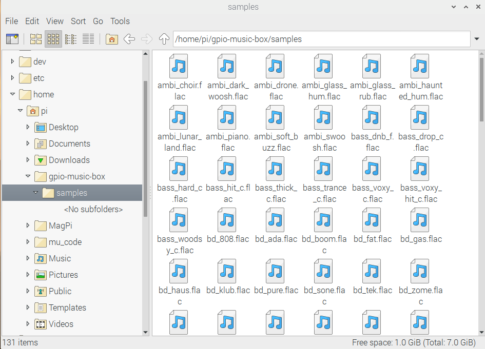

## Setting up your project

You're going to need some sample sounds for this project. There are lots of sound files on Raspbian, but they are a little tricky to play using Python. However, it's easy enough to convert the sound files to a different file format that can be used by Python in a straight-forward way.

--- task ---
The first thing you need to do is create a new directory in which to store all your files for the project. Create a directory called `gpio-music-box` in your `home` directory.
--- /task ---

[[[rpi-gui-creating-directories]]]

### Copying the sample sounds

--- task ---
Using the same method as before, create a new directory called `samples` inside your `gpio-music-box` directory.
--- /task ---

There are lots of sample sounds stored in `/usr/share/sonic-pi/samples`. These all need to be copied into `gpio-music-box/samples` directory.

--- task ---
Open a terminal window by clicking on the icon in the top left corner of your screen.

--- /task ---

--- task ---
Type the following to copy all the files from one directory to another:

```bash
cp /usr/share/sonic-pi/samples/* ~/gpio-music-box/samples/.
```
--- /task ---

When you are done, you should be able to see all the `.flac` sound files in the `samples` directory.




### Converting the sound files

You're going to need to convert the files from `.flac` files to `.wav` files, to play them using Python.

--- task ---
In a terminal, first change into you `samples` directory.

```bash
cd ~/gpio-music-box/samples
```
--- /task ---

You can learn more about converting media files and running commands on multiple files in the two sections below, if you want to.

[[[nix-bash-convert-media-files]]]

[[[nix-bash-batch-operations-on-files]]]

--- task ---
In your terminal type the following commands, which will convert all the `.flac` files to `.wav` files, then delete the old files.

```bash
for f in *.flac; do ffmpeg -i "$f" "${f%.flac}.wav"; done
rm *.flac
```

It will take a minute or two, depending on your Raspberry Pi model.
--- /task ---

You can see all the new wav files in the `samples` directory


