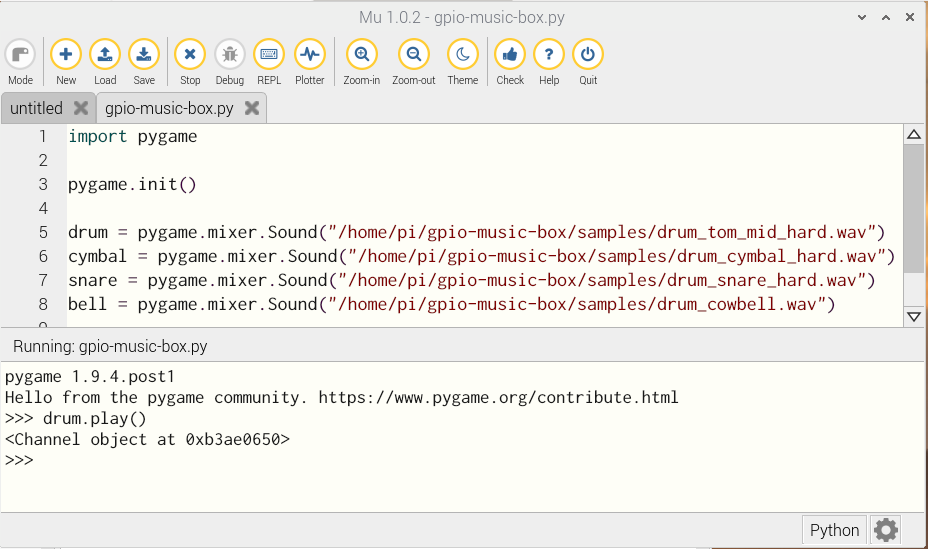

## Playing sounds

Now it's time to start writing your Python code. You can use any text editor or IDE to do this, but Mu is always an easy choice.


The first stage of creating the instruments of your music box is to test to see if Python can play a few of the samples you have copied.

[[[generic-python-playing-sound-files]]]

--- task ---
First you will need to import and initialise the pygame module for playing sound files.

```python
import pygame

pygame.init()
```
--- /task ---

--- task ---
Save this file in you `gpio-music-box` directory.
--- /task ---

--- task ---
Choose four sound files that you want to use for your project. Here we will be using:

```
drum_tom_mid_hard.wav
drum_cymbal_hard.wav
drum_snare_hard.wav
drum_cowbell.wav
```
--- /task ---

--- task ---
You can then create a Python object that links to each of these sound files. Each should have it's own individual name. For instance:

```python
drum = pygame.mixer.Sound("/home/pi/gpio-music-box/samples/drum_tom_mid_hard.wav")
```
--- /task ---

--- task ---
Create named onjects for your remaining three sounds.

--- hints --- --- hint ---
Your `.wav` files are all in your `samples` directory. So the file path will look like this:
```python
"/home/pi/gpio-music-box/samples/filename.wav"
```
--- /hint --- --- hint ---
Each sound object will need to have a unique name. You could call the next one `cymbal`:
```python
cymbal = pygame.mixer.Sound("/home/pi/gpio-music-box/samples/drum_cymbal_hard.wav")
```
--- /hint --- --- hint ---
Here's what your code should look like:
```python
import pygame

pygame.init()

drum = pygame.mixer.Sound("/home/pi/gpio-music-box/samples/drum_tom_mid_hard.wav")
cymbal = pygame.mixer.Sound("/home/pi/gpio-music-box/samples/drum_cymbal_hard.wav")
snare = pygame.mixer.Sound("/home/pi/gpio-music-box/samples/drum_snare_hard.wav")
bell = pygame.mixer.Sound("/home/pi/gpio-music-box/samples/drum_cowbell.wav")
```
--- /hint --- --- /hints ---
--- /task ---

--- task ---
Save and run you code. Then in the shell at the bottom of the Mu editor, you can use `.play()` commands to play the sounds.

```python3
drum.play()
```


--- /task ---

If you don't hear the sound, check that your speakers or headphones are working and that your volume is turned up.
